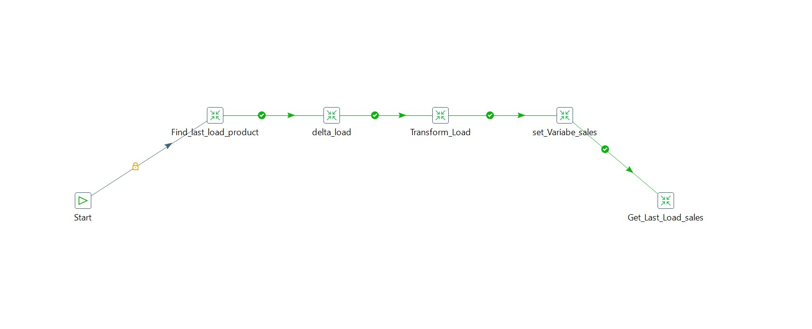
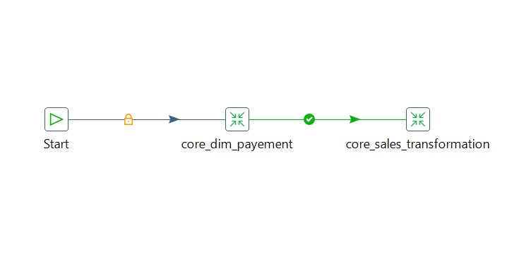
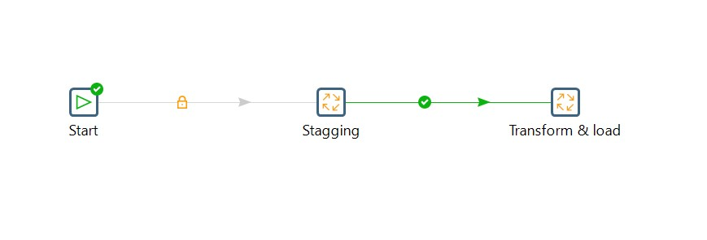

# -Sales-and-Products-Data-Warehouse
A comprehensive Sales and Products Data Warehouse built using the powerful combination of Pentaho Data Integration (PDI) and PostgreSQL DB. This project showcases an Extract, Transform, Load (ETL) process that seamlessly integrates, transforms, and loads sales and product data into a centralized data warehouse for efficient analysis and reporting.

        "ETL Staging Job"

        "ETL Core Job"

        "Full ETL Job"

